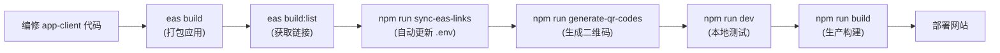

# 🚀 Expo 应用下载集成 - 快速参考

## 📋 集成完成项目

本项目已完成以下集成：

### ✅ 已创建的文件

1. **`src/components/Download.tsx`**
   - 完整的下载页面组件
   - 支持 Android 和 iOS 平台切换
   - 包含二维码展示

2. **`EXPO_BUILD_GUIDE.md`**
   - 详细的 Expo 打包指南
   - EAS Build 使用说明

3. **`DOWNLOAD_SETUP.md`**
   - 快速开始指南
   - 常见问题解答

4. **`scripts/sync-eas-links.mjs`**
   - 自动同步 EAS Build 链接的脚本

5. **`scripts/generate-qr-codes.mjs`**
   - 自动生成二维码的脚本

### ✅ 已更新的文件

1. **`src/App.tsx`**
   - 导入 Download 组件
   - 在页面中集成下载部分

2. **`src/components/Hero.tsx`**
   - 添加"立即下载应用"按钮

3. **`.env.example`**
   - 添加新的环境变量说明

4. **`package.json`**
   - 添加 npm 脚本命令

---

## ⚡ 3步集成 Expo 打包链接

### 1️⃣ 构建应用

```bash
cd app-client

# 构建 Android APK
eas build --platform android --type apk

# 构建 iOS
eas build --platform ios

# 查看构建列表
eas build:list
```

### 2️⃣ 自动同步链接

```bash
# 从 EAS Build 自动获取最新链接并更新 .env.local
npm run sync-eas-links
```

或手动配置编辑 `.env.local`：

```env
VITE_ANDROID_DOWNLOAD_URL="https://..."
VITE_IOS_DOWNLOAD_URL="https://..."
```

### 3️⃣ 生成二维码（可选）

```bash
# 自动生成二维码图片
npm run generate-qr-codes "https://android-url" "https://ios-url"
```

## 🧪 本地测试

```bash
npm run dev

# 访问: http://localhost:3000/#download
```

## 📱 下载页面功能

| 功能        | 说明                       |
| ----------- | -------------------------- |
| 🟢 平台选择 | 在 Android 和 iOS 之间切换 |
| 📥 下载按钮 | 直接打开应用下载链接       |
| 🔲 二维码   | 快速扫码分享               |
| 📋 系统要求 | 显示最低版本和文件大小     |
| 💡 帮助信息 | 常见问题和解决方案         |

## 🔗 环境变量

### 必需

```env
# Android 应用URL（APK、应用商店或 Expo 链接）
VITE_ANDROID_DOWNLOAD_URL="https://..."

# iOS 应用URL（TestFlight 或 App Store）
VITE_IOS_DOWNLOAD_URL="https://..."
```

### 可选

```env
# 二维码图片URL
VITE_ANDROID_QR_CODE="https://..."
VITE_IOS_QR_CODE="https://..."
```

## 📊 常用命令

```bash
# 查看所有构建
eas build:list --limit 10

# 查看特定平台最新构建
eas build:list --platform android --limit 1 --json

# 下载本地 APK
eas build:download --id <BUILD_ID> --path ./app.apk

# 同步 EAS 链接
npm run sync-eas-links

# 生成二维码
npm run generate-qr-codes <android-url> <ios-url>

# 本地开发
npm run dev

# 生产构建
npm run build
```

## 📍 页面位置

- **网站首页**：Hero 中添加了"立即下载应用"按钮
- **完整下载页面**：`http://your-domain.com/#download`
- **快速入口**：主页"快速入口"部分仍有下载链接

## 🎯 工作流



## 🚨 常见问题

**Q: 下载链接长期有效吗？**

- A: EAS 链接长期有效（不会过期）。TestFlight 链接需要定期更新。

**Q: 二维码失效了怎么办？**

- A: 运行 `npm run generate-qr-codes <新url> <新url>` 重新生成

**Q: 支持匿名下载吗？**

- A: 支持。直接提供 APK 链接即可，用户无需登录

**Q: 如何统计下载次数？**

- A: 在 URL 中添加 UTM 参数或使用分析工具

## 📚 详细文档

- 完整指南：[DOWNLOAD_SETUP.md](./DOWNLOAD_SETUP.md)
- Expo 打包：[EXPO_BUILD_GUIDE.md](./EXPO_BUILD_GUIDE.md)

## ✨ 功能演示

访问 `http://localhost:3000/#download` 查看：

```
┌─────────────────────────────────┐
│   获取 Coin Planet 应用         │
│                                 │
│  [Android] [iOS]  ← 平台选择   │
│                                 │
│  ┌─────────────────────────┐   │
│  │ Android 版本            │   │
│  │ 系统: Android 7.0+      │   │
│  │ 文件: 85 MB             │   │
│  │                         │   │
│  │ [📥 下载 APK] [扫码📱]  │   │
│  └─────────────────────────┘   │
│                                 │
│  💡 下载遇到问题？              │
│  • 启用"未知来源"权限           │
│  • 尝试切换 Wi-Fi               │
└─────────────────────────────────┘
```

## 🎉 完成！

所有功能已集成，只需：

1. 打包应用（EAS Build）
2. 获取链接（`npm run sync-eas-links`）
3. 生成二维码（`npm run generate-qr-codes`）
4. 部署网站（`npm run deploy:cf`）

---

**最后更新**: 2026年4月16日
**版本**: 1.0.0
