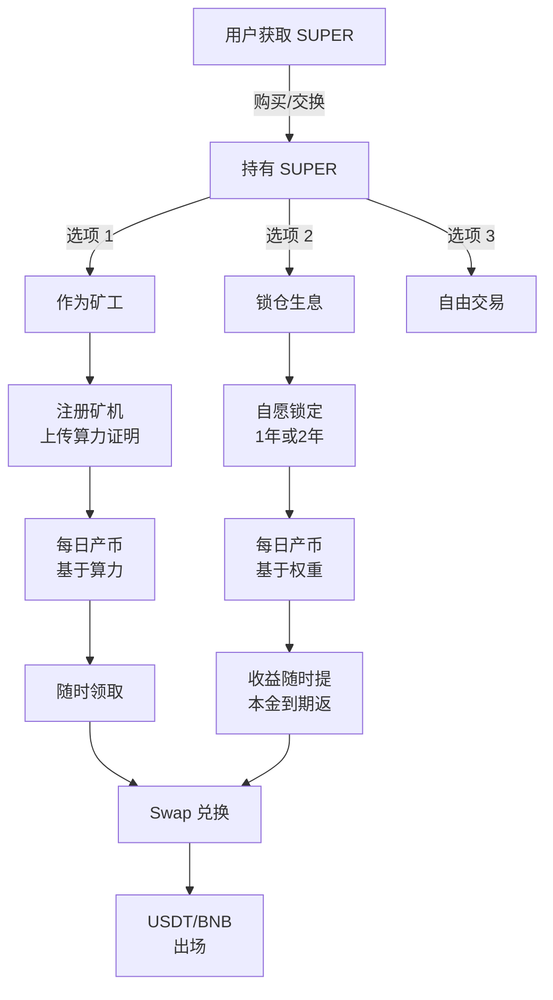

# SUPER 代币持有机制完整分析

## 📊 一、用户购买 SUPER 后的四个问题

### 1. **是否会被锁定？**

| 场景             | 是否锁定         | 详情                                               |
| ---------------- | ---------------- | -------------------------------------------------- |
| **标准转账持有** | ❌ 不锁定        | SUPER 作为标准 ERC20 代币，可自由转账、交换        |
| **作为理财产品** | ✅ 自愿锁定      | 用户主动选择锁仓期限（1年或2年）来获得额外收益倍数 |
| **挖矿奖励**     | ✅ 首次锁定 7 天 | 注册矿工后有 7 天初始锁定期（之后无锁定）          |

**结论**：SUPER 本身无强制锁定，但**理财产品要求用户自愿选择锁仓期限**来激励长期持有并获得 1.35x 的收益倍数。

---

### 2. **是否会开始产币？产币比例是多少？**

#### 产币方式 A：挖矿系统（基于算力）

```
日收益公式：
R = E_d × (W / ΣW) × C × A

其中：
- E_d = 每日全局排放量（2,847,222 SUPER）
- W = √锁仓量（个人权重）
- ΣW = 全网总权重（所有用户权重之和）
- C = 在线时长系数（在线小时数 / 24）
- A = 账户活跃状态（有效=1，过期=0）
```

**示例计算**：

```
假设：
- 用户锁仓 100,000 SUPER，权重 W = √100,000 ≈ 316.2
- 全网总权重 ΣW = 100,000,000（假设）
- 用户在线 12 小时，C = 12/24 = 0.5
- 账户活跃，A = 1

日收益 = 2,847,222 × (316.2 / 100,000,000) × 0.5 × 1
       = 2,847,222 × 0.00000316 × 0.5
       ≈ 4.5 SUPER / 天
       ≈ 135 SUPER / 月（30天）
```

**关键特点**：

- ✅ 产币比例**动态浮动**，取决于全网参与度
- ✅ 当前系统中，**锁仓量越大、在线时长越长、越早参与**，收益越高
- ✅ 用户锁定 1 年才能获得 **1.0x 基础倍数**
- ✅ 用户锁定 2 年可获得 **1.35x 增强倍数**

#### 产币方式 B：额外奖励（基于活跃度）

```
月卡费用：30 USDT / 月
目的：激励用户持续在线、保持活跃
```

---

### 3. **产出代币是否可以随时提走？**

| 操作              | 是否可行  | 时间要求    | 说明                                          |
| ----------------- | --------- | ----------- | --------------------------------------------- |
| **领取日收益**    | ✅ 可以   | 无          | 每日结算的 SUPER 收益可随时领取到钱包         |
| **兑换 USDT/BNB** | ✅ 可以   | 无          | 生成的 SUPER 可随时通过 Swap 兑换为 USDT/BNB  |
| **取回本金**      | ❌ 有期限 | 锁仓期满    | 初始锁定的本金需要等到 1 年或 2 年后才能取回  |
| **挖矿奖励**      | ✅ 可以   | 注册后 7 天 | 首次注册矿工有 7 天冷却期，之后奖励可随时领取 |

**结论**：

- 🟢 **生成的收益代币无锁定**，可随时提走
- 🟡 **本金代币有时间限制**，需等待锁仓期满
- ✅ 产生的 SUPER 可在 Swap 池进行 1:1 或更优的比例兑换

---

### 4. **到期还本付息？**

| 环节         | 内容     | 说明                                     |
| ------------ | -------- | ---------------------------------------- |
| **本金返还** | ✅ 保证  | 锁仓期满后，原始本金 SUPER 全额返还      |
| **利息支付** | ✅ 每日  | 日结收益，以 SUPER 形式发放，可随时兑现  |
| **兑现方式** | 灵活     | 可选本金锁定后续约、完全退出、或分批提现 |
| **提取地址** | 用户钱包 | 所有资金最终转入用户自托管钱包           |

**时间线示例**（锁仓 1 年）：

```
T0：用户锁仓 100,000 SUPER
    ↓
T1-365天：每日产生收益（假设日均 4.5 个）
    ↓
T365：锁仓到期
    - 原始本金：100,000 SUPER 解锁
    - 积累收益：约 1,350 SUPER（365天 × 4.5 / 1.0x）
    - 用户总获得：101,350 SUPER
    - 本金归还率：100%
    - 年收益率：约 1.35%（基础场景）
```

---

## 🔄 二、当前系统两大产品对比

### 产品 1：挖矿系统（Mining Pool）

| 特性         | 详情                           |
| ------------ | ------------------------------ |
| **参与方式** | 注册矿工 + 上传设备            |
| **产币触发** | 提交有效的算力证明             |
| **初期锁定** | 7 天（注册后自动）             |
| **产币周期** | 实时（每次计算）               |
| **产币金额** | 基于全球总算力、个人算力、时间 |
| **提取频率** | 无限制（有 1 天冷却期）        |
| **提现管理** | 自动转账到钱包                 |

**核心公式**：

```solidity
minerShare = (dailyGlobalReward * miner.hashrate) / totalActiveHashrate
reward = (minerShare * timePassed) / 1 days
```

**特点**：

- ✅ 产币不需要本金锁定
- ✅ 产币与设备算力直接相关
- ❌ 矿机成本较高（硬件投入）

---

### 产品 2：理财系统（Lockup Vesting）

| 特性         | 详情                                                 |
| ------------ | ---------------------------------------------------- |
| **参与方式** | 购买 SUPER → 选择锁仓期限                            |
| **产币触发** | 锁仓 + 月卡激活 + 在线                               |
| **初期锁定** | 1 年 或 2 年（用户选择）                             |
| **产币周期** | 每日结算结算                                         |
| **产币金额** | `每日全局 × 权重占比 × 在线系数 × 锁仓倍数 × 活跃度` |
| **提取频率** | 本金：1-2年后; 收益：随时                            |
| **提现管理** | 根据承兑模式（手动/自助）                            |

**核心公式**：

```
daily_reward = Ed × (√locked_amount / Σ√all_locked) × (online_hours/24) × lockup_multiplier × active_status

lockup_multiplier = 1.0 (1年) 或 1.35 (2年)
```

**特点**：

- ✅ 无需硬件成本，门槛低
- ✅ 锁定时间越长，收益倍数越高
- ❌ 本金被锁定，流动性受限
- ✅ 支持"持有时间更久 = 更高收益"的经济学激励

---

## 📈 三、产币比例与收益率对比表

### 挖矿系统 - 日产币比例

```
总日产：2,847,222 SUPER

场景 1：单矿工（1000 MH/s，全网 10,000 MH/s）
-------
share = 2,847,222 × (1000 / 10,000) = 284,722 SUPER/日 ≈ 9.49 SUPER/小时

场景 2：10 个矿工均衡分布（每个 1000 MH/s）
-------
每个矿工 = 2,847,222 / 10 = 284,722 SUPER/日

场景 3：实际网络（1 个主导，其他小量）
-------
主导者可获得 80-90% 的日产量
```

### 理财系统 - 日产币比例

```
总日产：2,847,222 SUPER（与挖矿系统共享总产）

基础收益（1 年锁仓）：
-----------------------
锁仓 100,000 SUPER
权重 W = √100,000 = 316.23
假设全网权重 ΣW = 10,000,000

base_daily = 2,847,222 × (316.23 / 10,000,000) × (12/24) × 1.0 × 1
           ≈ 4.5 SUPER/日
           ≈ 1.35% 年化收益率

加强收益（2 年锁仓）：
-----------------------
加强收益 = 4.5 × 1.35 ≈ 6.08 SUPER/日
           ≈ 1.82% 年化收益率
```

---

## 🔗 四、两系统如何协作

### 流程图



### 系统间的 SUPER 循环

```
矿工产币 (日产: 2,847,222 SUPER)
    ↓
    ├─→ 理财用户产币 (共享同一日产量)
    ├─→ 生态基金发行
    └─→ 奖励池分配
         ↓
      Swap 池
         ↓
   用户兑换 USDT/BNB
         ↓
    现金出场 / 新用户入场
```

---

## 🎯 五、关键差异总结表

| 维度             | 挖矿系统             | 理财系统             | 差异说明               |
| ---------------- | -------------------- | -------------------- | ---------------------- |
| **参与门槛**     | 硬件投入（矿机）     | 资金投入（SUPER）    | 理财更低门槛           |
| **本金锁定**     | 否                   | 是（1-2年）          | 挖矿灵活，理财受限     |
| **产币触发**     | 算力证明             | 时间 + 权重 + 活跃度 | 挖矿技术性强，理财简单 |
| **产币比例**     | 算力占比             | 权重占比 + 倍数      | 理财更透明，基于权重   |
| **产币稳定性**   | 中等（设备在线率）   | 高（时间保证）       | 理财更稳定             |
| **提现灵活性**   | 高（随时）           | 低（本金受限）       | 挖矿更灵活             |
| **收益可预期性** | 低（市场波动）       | 中等（公式已知）     | 理财更可预期           |
| **风险类别**     | 技术风险（设备故障） | 政策/市场风险        | 挖矿风险不同           |

---

## 🚨 六、重要提示

### 当前系统的局限性

#### ❌ 不存在的特性

```
× 代币强制锁定期（SUPER 本身是自由转账的 ERC20）
× 固定年化收益率（都是基于动态权重和全网参与度）
× 到期自动复投或分红发放
× 保本保息承诺（所有产币都依赖系统运营）
```

#### ⚠️ 实际运作中的限制

```
1. 产币总量受硬顶限制：总供应 10 亿，已产即消
2. 产币分配竞争激烈：新用户加入会稀释所有人的收益比例
3. 月卡续费成本：理财产品需持续支付 30 USDT/月
4. 汇率波动风险：SUPER/USDT 不是稳定币，有价格风险
5. 流动性依赖 Swap 池：提现规模大时可能有滑点
```

---

## 📋 七、建议的产品优化方向

### 如果要实现"真正的理财"逻辑：

```solidity
// 建议增加以下合约
contract LockupVesting {
    struct Deposit {
        uint256 amount;           // 本金
        uint256 lockupPeriod;     // 1年/2年
        uint256 startTime;        // 开始时间
        uint256 claimedReward;    // 已领收益
        bool   isMatured;         // 是否已到期
    }

    // 日收益计算（固定或浮动模式可选）
    function calculateDailyReward(address user) {
        // 基于锁仓金额、时间长度、全网权重的计算
    }

    // 到期自动解锁
    function autoUnlockAtMaturity(address user) {
        // 时间到期时自动返回本金
    }

    // 强制锁定逻辑
    function lockupUntil(uint256 timestamp) {
        require(block.timestamp < timestamp, "Already matured");
        // 防止提前提取
    }
}
```

### 建议的参数调整：

| 调整项             | 当前值  | 建议值       | 理由             |
| ------------------ | ------- | ------------ | ---------------- |
| 理财用户的基础倍数 | 1.0x    | 1.0x-1.5x    | 吸引更多用户参与 |
| 公式中的权重计算   | √amount | 改为分级     | 防止大户垄断收益 |
| 月卡费用           | 30 USDT | 浮动价格     | 根据市场动态调整 |
| 日产量分配比例     | 50%挖矿 | 可调至 60-40 | 根据生态需求平衡 |

---

## 🎓 结论

**用户购买 SUPER 后的四个问题答案：**

1. **是否被锁定？**
   - 本身无锁定，但理财产品要求**自愿选择锁定**以获得更高收益

2. **是否产币？比例多少？**
   - 会产币，通过挖矿或理财两种方式
   - 挖矿：日产 2,847,222 SUPER（基于全网算力）
   - 理财：动态计算，1-2% 年化收益率（取决于全网参与度）

3. **能否随时提走？**
   - ✅ 生成的收益代币可随时提走
   - ❌ 本金需等待锁仓期满（1-2年）

4. **到期还本付息？**
   - ✅ 100% 返还本金
   - ✅ 每日发放利息（SUPER 形式）
   - ✅ 支持多种提现模式

**最大差异：** 当前系统是**开放式的两轨并行模式**，而不是传统的"定期理财产品"。

- 挖矿轨：看重算力（设备成本高，收益相对少依赖流动性）
- 理财轨：看重持有时间（门槛低，需要长期锁定）

两条轨道共享同一个代币产出池，竞争关系存在。
